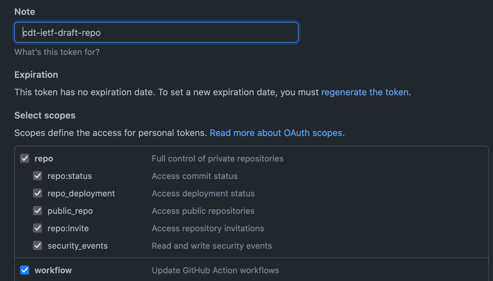
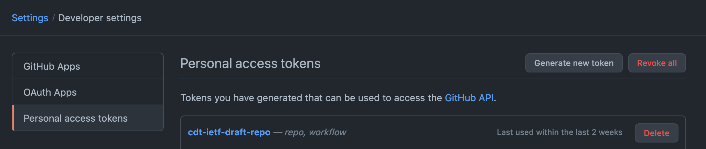
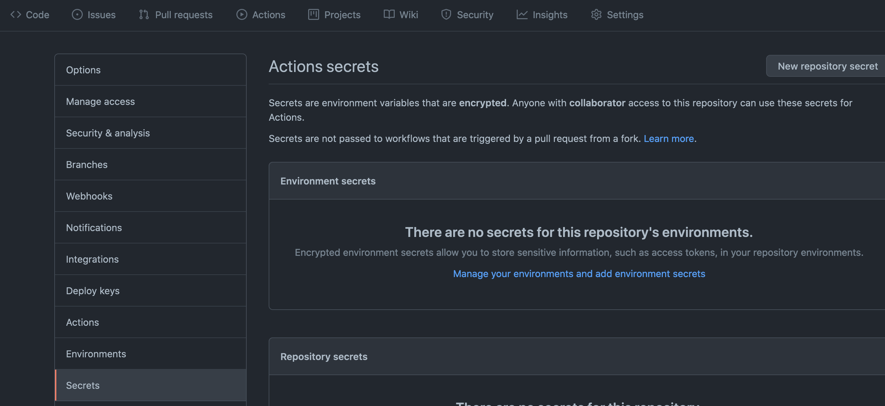
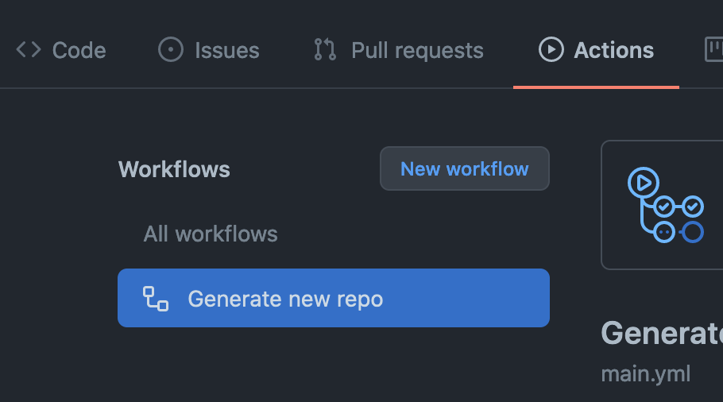
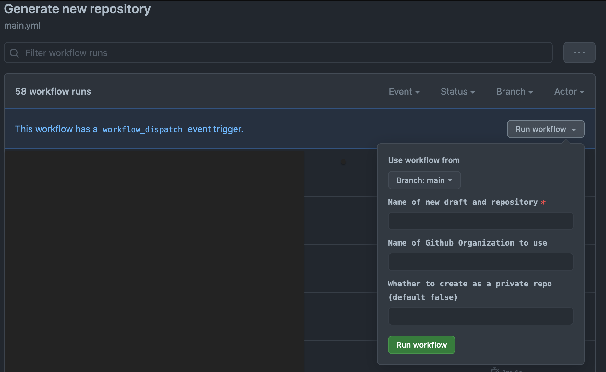

# Create IETF Draft Repo Github Action

This Github Action creates a draft IETF repository in the designated author's
personal Github account or Github Organization.

This new repository includes the following features:

* Makefile for generating HTML, XML, and TXT versions of a draft Markdown file
* Github Actions workflow that validates the Markdown draft, generates the
alternate versions, and commits them to the repository
* Github Actions workflow that uploads the XML version of the draft to the IETF
Datatracker and triggers a confirmation email.

### Inputs

*draft-name*: Name of the new draft- this will be prepended with `draft-`

*org-name*: Github Organization name to create the draft repo in, if this is
not provided then the action will create it in the personal account of the
personal access token (saved in Secrets) owner

*private-repo*: Boolean true or false, defaults to false

## Setting Up This Action

### Creating Workflows Repo

This action must reside in a Github repository in order to be used by a Github
Action. We recommend having a dedicated private repository to run these, as
anyone with access to the repository will be able to run the workflow with the
permissions listed below, but it can also be added to a repository that
contains other code.

More details about Github Actions can be found in their
[documentation](https://docs.github.com/en/actions/learn-github-actions/introduction-to-github-actions).

The following YAML file will add this action to a repository:

```
# {REPO_ROOT}/.github/workflows/main.yml

name: 'Generate new repository'
on:
  workflow_dispatch:
    inputs:
      draft-name:
        required: true
        description: 'Name of new draft and repository'
      org-name:
        description: 'Name of Github Organization to use'
      private-repo:
        description: 'Create as a private repo (default false)'
        default: false

jobs:
  generate-new-repository:
    runs-on: ubuntu-latest
    name: Create a new IETF draft repository
    steps:
      - name: Create new repository action
        id: generate-repo
        uses: IRTF-HRPC/create-ietf-draft-repo-action@v0.1.0
        with:
          draft-name: ${{ github.event.inputs.draft-name }}
          create-repo-github-user: ${{ secrets.CREATE_REPO_GITHUB_USER }}
          create-repo-github-token: ${{ secrets.CREATE_REPO_GITHUB_TOKEN }}
          org-name: ${{ github.event.inputs.org-name }}
          private-repo: ${{ github.event.inputs.private-repo }}
```

### Creating Personal Access Token

To use this action, you'll need to create a token that performs API calls on
your behalf. If using this action within a Github Organization, we
recommend using a machine user whose repository permissions are scoped to only
the repositories it needs access to. *Be aware that this using this token will
allow any users with access to the workflow repo to every repository the token
owner has access to.*

You'll need to provide the Github Actions workflow repository with a Github API
Token that has at a minimum the following permissions:

* repo
* workflow



Create your Github token by logging in as the intended user, going to the user
dropdown, then Settings -> Developer settings -> Personal access tokens.



Generate the token and save the value.

Now go to the repository's Settings tab, then the Secrets sidebar option. Click
on the New repository secret button. Provide the Github token as a Github
Actions secret with the key `CREATE_REPO_GITHUB_TOKEN`, and the current user as
a secret with the key `CREATE_REPO_GITHUB_USER`.



## How To Create A New Draft Repo

To create a new draft repository, go to the Actions tab and select Generate new
repository in the sidebar.



Under the workflow runs section there will be a button labeled Run workflow.
Clicking this brings up several options. The name will be the exact name the
new repo will create, so ensure this doesn't conflict. Add the name of the
Github Organization if this should exist under an organization rather than as
the user's own. And lastly, set the last option to true to create a private
repo.



## How To Use Newly Created Repo

The created repo has two capabilities initialized upon creation.

The first is a validation workflow against the markdown draft file that runs on
every commit, and generates and commits HTML, XML, and TXT files from the draft
markdown back to the repo upon push to the main branch. (Note that the first
commit will fail on generation since the default draft template is not valid.)

The second is a manually triggered workflow that takes an email address as
input, and submits the current version of the repository's draft to
[IETF Datatracker](https://datatracker.ietf.org/submit/). This will result in a
confirmation email being sent to the address provided.
